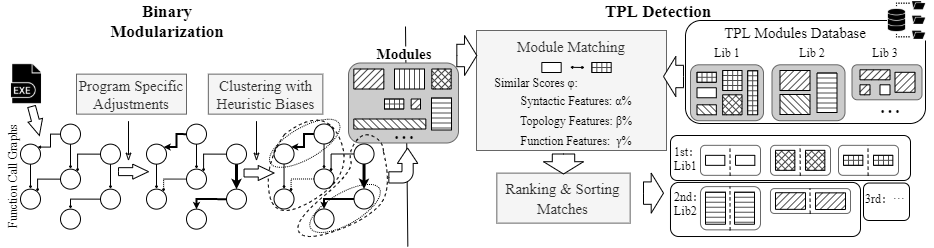
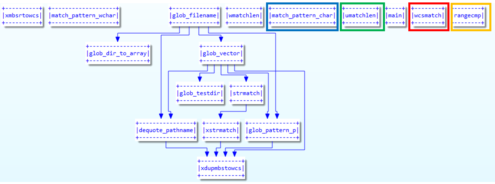
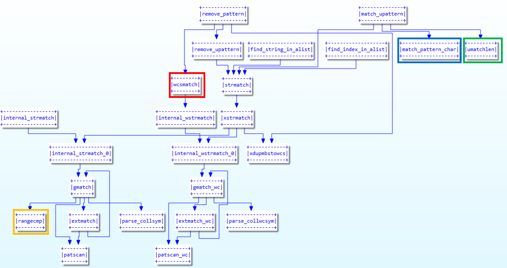

# DATA SET FOR *OPEN SCIENCE POLICY*

## Introduction

<!-- With the rapid growth of software, using third-party libraries (TPLs) has become increasingly popular.
The prosperity of the library usage has provided the software engineers with handful of methods to facilitate and boost the program development.
Unfortunately, it also poses great challenges as it becomes much more difficult to manage the large volume of libraries.
Researches and studies have been proposed to detect and understand the TPLs in the software. 
However, most existing approaches rely on syntactic features, which are not robust when these features are changed or deliberately hidden by the adversarial parties. 
Moreover, these approaches typically model each of the imported libraries as a whole, therefore, cannot be applied to scenarios where the host software only partially uses the library code segments. -->

To detect both fully and partially imported TPLs at the semantic level, we propose ModX, a framework that leverages novel program modularization techniques to decompose the program into fine-grained functionality-based modules. 
By extracting both syntactic and semantic features, it measures the distance between modules to detect similar library module reuse in the program. 
Experimental results show that ModX outperforms other modularization tools by distinguishing more coherent program modules with 353% higher module quality scores and beats other TPL detection tools with on average 17% better in precision and 8% better in recall.

## Workflow

Workflow

This Figure shows the workflow of ModX. It consists of two phases, namely Binary Modularization and TPL Detection, to predict TPLs from a binary program. 

There are two phases to detect TPLs from a binary program.
In the first phase, it proposes a module quality metric, which is based on community detection algorithm with program specific adjustments.
ModX starts from parsing the binary program, extracting call graphs with various features.
Then the function volume is calculated, giving some edges of the call graph more weight then others.
Lastly, a modularization algorithm is applied to the graph, which clusters the nodes hierarchically into several modules.
Now the binary could be viewed as a combination of modules as shown in central of the Figure, where each brick represents a module consisting of function nodes and the calling relationships.

In the second phase, ModX performs the TPL detection by matching program modules with TPL modules.
The TPL modules are generated in the same way as the first phrase and stored in a database.
The matching is equivalent to searching the presence of partial functionality of a library once in a time, because every module contains an individual functionality of the program.
In module matching procedure, the matching scores (α, β and γ) come from similarities between every available feature of different modules, e.g topology features, syntactic features, intra-function features. 
The matching would result in many potential matches, thus a quick ranking and sorting method is needed for filtering. 
The final output of the ModX is a list of libraries, with one-to-one modules matching results as the proof.
Each matching result indicates the presence of partial functionality of a library, because every module corresponds to an individual functionality of the program.
After the matching, it also introduces module and library importance scores to help improve the library detection accuracy.

## Modularization Example: Program "BASH"

(a)Manual Module

(b)ModX Module

These two Figures show the concrete example of the modules generated by human experts and by ModX respectively. 
Since human experts group the source files to form the modules, there may be some isolated functions in each module. 
As shown in (a), there are 6 isolated functions with 4 being marked in different color boxes. From the names, we know that most of the functions in this module have the similar functionality to process wild-cast strings.
For the generated module in Figure (b), ModX has grouped the 4 isolated functions (marked in the color boxes) into a bigger module with some additional related functions.
From the function names, we can notice that most of the functions are with the same functionality, which suggests that ModX has produced a more complete module than the manually labelled approach.

The overall modularization could be found in directory "Case_Study", with the name "bash_grouper.pkl".

## Usage Tips

1. All the datas are serialized by pickle(Python 3.8).

2. For "*reports.pkl" and "*records_pkl" files, the data stored is normal python instance which is also self-explanatory.

3. In any names:
 prefix "bat" stands for the tool "BAT", 
 prefix "oss" stands for the tool "OssPolice",
 prefix "bcd" stands for the method "BCD",
 prefix "abcd" or not prefix stand for our tool ModX.

4. The "*_grouper.pkl" files have the modularization results, which are stored as "Grouper" like classes.
The definition and usage of the classes can be found in the directory "/utility_scripts".
You can use script "from group_class import *" to import the needed classes before loading any "*_grouper.pkl".

5. All the "Grouper" instance can be corresponding to the binary file in the data set by name.
But by this time, the corresponding scripts are not offered.

6. The corresponding scripts as well as many other scripts like, scripts for extracting functions and features from binaries,
scripts for modularization, scripts for showing results graphically in IDA-pro just like the figures in the paper, etc., 
are not open now because it might include plenty information about the authors.
We prefer to make these codes avaliable upon acceptance.